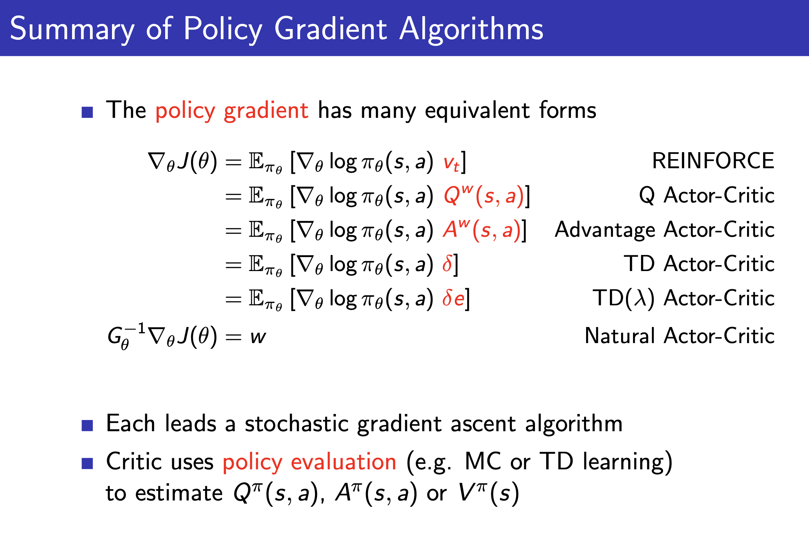

# Policy Gradient 

#### Gole: 

Given policy $\blue\pi$ find best $\blue\theta$.

$$\pi_\theta \to \pi_{\theta^*} $$

---
<!-- Scoped style -->

# How do we know which <!-- fit -->
# Policy is good  <!-- fit -->
## or How to measure the quality of a policy $\blue{\pi_\theta}$? 

---

 

---

#### 1. Start state value:

$$ J_1 (\theta) = V^{\pi_\theta} (s_1) = \mathbb{E}[v_1]  $$

#### 2. Average value: 

$$ J_{avV} (\theta) = \sum_s d^{\pi_\theta}(s) \green{V^{\pi_\theta}(s)}  $$
or 
$$ J_{avR} (\theta) = \sum_s d^{\pi_\theta}(s) \green{\sum_a \pi_\theta (s,a) \mathcal{R}^a_s } $$

---
# Policy Optimization
* Policy Based RL is an **optimization problem**. 
* Find $\theta$ that maximises $J(\theta)$. 

| Without Gradient | Uses Gradient |
| --- | ---|
|  Hill climbing. | Gradient decent| 
| Simplex /amoeba/ Nelder Mead. |  Conjugate gradient|
| Genetic algorithms. | Quasi-newton|

* We will focus on gradient descent. 
---
# Policy Gradient 

Let $\green{J(\theta)}$ be andy policy objective function.

$\theta \to \theta'$ such that $J(\theta) < J(\theta')$

$$ \Delta \theta = \alpha \blue{ \nabla_\theta J(\theta)} $$
Where
$$\blue{\nabla_\theta J(\theta)} := \left[ \frac{\partial J(\theta)}{\partial \theta_1},\frac{\partial J(\theta)}{\partial \theta_2},...,\frac{\partial J(\theta)}{\partial \theta_n}  \right]$$

---
<!-- Scoped style -->

## Computing Gradients By Finite Differences

* To evaluate policy gradient of $\pi_{\theta}(s, a)$
* For each dimension $k \in[1, n]$
	*	Estimate kth partial derivative of objective function w.r.t. $\theta$
  * perturbing $\theta$ by small amount $\epsilon$ in $k$ th dimension

$$
\frac{\partial J(\theta)}{\partial \theta_{k}} \approx \frac{J\left(\theta+\epsilon u_{k}\right)-J(\theta)}{\epsilon}
$$

*  where $u_{k}$ is unit vector with 1 in kth component, 0 elsewhere. 
*  Uses $n$ evaluations to compute policy gradient in $n$ dimensions. 
*  Simple, noisy, inefficient - but sometimes effective. 
*  Works for arbitrary policies, even if policy is not differentiable. 

---

# Score Function

$$ \begin{split}\nabla_\theta \pi_\theta(s,a) & = \pi_\theta(s,a) ~~ \frac{\nabla_\theta \pi_\theta(s,a)}{\pi_\theta(s,a)}
\\ & = \pi_\theta(s,a) ~~ \color{#405198}\underbrace{ \nabla_\theta \log_e(\pi_\theta(s,a))}_{\text{Score Function}}
\end{split}$$

---
<!-- Scoped style -->

## Softmax Policy
* We will use a softmax policy as a running example
* Weight actions using linear combination of features $\phi(s, a)^{\top} \theta$
- Probability of action is proportional to exponentiated weight
$$
\pi_{\theta}(s, a) \propto e^{\phi(s, a)^{\top} \theta}
$$
- The score function is
$$
\nabla_{\theta} \log \pi_{\theta}(s, a)=\phi(s, a)-\mathbb{E}_{\pi_{\theta}}[\phi(s, \cdot)]
$$

---
<!-- Scoped style -->

## Gaussian Policy
- In continuous action spaces, a Gaussian policy is natural
- Mean is a linear combination of state features $\mu(s)=\phi(s)^{\top} \theta$
- Variance may be fixed $\sigma^{2}$, or can also parametrised
- Policy is Gaussian, $a \sim \mathcal{N}\left(\mu(s), \sigma^{2}\right)$
- The score function is
$$
\nabla_{\theta} \log \pi_{\theta}(s, a)=\frac{(a-\mu(s)) \phi(s)}{\sigma^{2}}
$$

---

---
<!-- scoped style -->

## reducing variance using a critic
- monte-carlo policy gradient still has high variance
- we use a critic to estimate the action-value function,
$$
q_{w}(s, a) \approx q^{\pi_{\theta}}(s, a)
$$
- actor-critic algorithms maintain two sets of parameters 
	- **Critic** Updates action-value function parameters $w$ 
	- **Actor** Updates policy parameters $\theta$, in direction suggested by critic
- Actor-critic algorithms follow an approximate policy gradient
$$
\begin{aligned}
\nabla_{\theta} J(\theta) & \approx \mathbb{E}_{\pi_{\theta}}\left[\nabla_{\theta} \log \pi_{\theta}(s, a) Q_{w}(s, a)\right] \\
\Delta \theta &=\alpha \nabla_{\theta} \log \pi_{\theta}(s, a) Q_{w}(s, a)
\end{aligned}
$$

---

---
<!-- Scoped style -->

---

---
<!-- Scoped style -->

---

---
<!-- Scoped style -->

---

---
<!-- Scoped style -->

---
