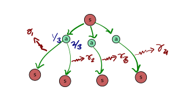
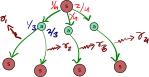

# Definitions

1. Agent.
2. Environment.
3. State.
4. Observation.
5. Episode.

---

## MDP

A MDP is a 4-tuple ($\mathbb{S}$,$\mathbb{A}$,$P_a$,$R_a$), where: 
* $\mathbb{S}:=$ is a set of states called the state space.
* $\mathbb{A}:=$ is a set of actions called the action space.
* $\mathbb{A}_s:=$ is a set of actions available from state $s\epsilon \mathbb{S}$.
* $P_a(s,s') := \mathbb{P}(s_{t+1}= s' | s_t = s, a_t = a)$ is the probability that action $a$ in state $s$ at time $t$ will lead to state $s'$ at time $t+1$.
* $R_a(s,s')$ is the immediate reward recived after transition from $s$ to $s'$ .

---

---

## Marcov property 

$$\mathbb{P}(S_{t+1} | S_t, A_t) =\mathbb{P}(S_{t+1} | S_t, A_t, S_{t-1}, A_{t-1}, ...)  $$ 

 

---

## Reward function.
Given an MDP we define reward function. $s ,s'\epsilon \mathbb{S}, a\epsilon \mathbb{A}$
$$ r(s) := \mathbb{E}_{a,s'}[R_{t} | S_t = s] $$ 
$$ r(s,a) := \mathbb{E}_{s'}[R_{t} | S_t = s, A_t =a ] $$ 
$$ r(s,a,s') := \mathbb{E}[R_{t} | S_t = s, A_t =a,S_{t+1} = s' ] $$ 
---

---
## Policy 
Given an MPD, we define

$$ \pi(a|s) := \mathbb{P} [A_t = a | S_t = s] $$

* A policy fully defines the behavior of an agent.

---

Now we can talk about: 
$$ r(s) = \mathbb{E}_{a,s'}[R_{t} | S_t = s] $$ 

---
## Episode

Is a sequence :

$$E_n := [(S_0^n,A_0^n,R_0^n,{S'}_0^n),(S_1^n,A_1^n,R_1^n,{S'}_1^n),...,(S_T^n,A_T^n,R_T^n,{S'}_T^n)]$$
$$E_n := [(S_0,A_0,R_0,S'_0),(S_1,A_1,R_1,S'_1),...,(S_T,A_T,R_T,S'_T)]$$
where $S'_t=S_{t+1}$.Its just $n^{th}$ run on MDP.

---
## Episode's Probability
Given a policy $\pi$. Let us take an episode
 $$E_n := [(S_0,A_0,R_0,S'_0),(S_1,A_1,R_1,S'_1),...,(S_T,A_T,R_T,S'_T)]$$
$$ \Big( \mathbb{P}(E_n) \Big)_\pi = \sum_{i=0}^T \pi(A_i | S_i) P_{A_i}(S_i,S'_i) $$
---
## Return
A given episode $E_n$ of MDP and a given $\gamma\epsilon[0,1]$.
$$G_t:=R_{t} + \gamma R_{t+1} + ... = \sum_{k=0}^{\infin} \gamma^k R_{t+k}    $$
$$G_t(E_n) := R_{t}^n + \gamma G_{t+1}(E_n)$$
$$ G_t^n := R_{t}^n + \gamma G_{t+1}^n$$

---

## State-value function $v$

Given an MDP and a policy $\pi$ on it, we define $\forall s \epsilon S$
* $$ \begin{split} v_\pi (s) &= \mathbb{E}_\pi [G_t|S_t=s] \\ & = \mathbb{E}_\pi[R_t + \gamma R_{t+1} +\gamma^2R_{t+2} + ... | S_t = s]\\& = \mathbb{E}_\pi[R_t + \gamma ( R_{t+1} +\gamma R_{t+2} + ...) | S_t = s]\\ & = \mathbb{E}_\pi [R_{t} + \gamma G_{t+1}|S_t=s]\end{split} $$
* $$ \mathbb{E}_\pi[R_t + ] $$
---

* $$ \begin{split} v_\pi (s) & = \sum_a \pi (a|s) \sum_{s',r} p(s',r|s,a)[r+\gamma v_\pi(s')], ~~ \forall s \epsilon S \\ &   \end{split} $$

---
## See inside This equation

$$ v_\pi (s) =\color{blue} \sum_a \pi (a|s) \Bigg( \color{red} \sum_{s'} p(s'|s,a) \color{4c9040}[r(s,a,s')+\gamma v_\pi(s')]\color{blue}\Bigg)_{a,s}$$

---
##  Action-value function $Q$

* $$q_\pi(s,a) = \mathbb{E}_\pi [G_t | S_t = s, A_t = a] $$
* $$q_\pi(s,a) = \mathbb{E}_\pi [R_t + \gamma G_{t+1}| S_t=s,A_t=a]$$
* $$ q_\pi(s,a) = \sum_{s',r} p(s',r|s,a) [r+\gamma v_\pi(s')], \forall s\epsilon S, \forall a \epsilon A$$

---
## See inside This equation

 $$ q_\pi(s,\textcolor{blue}{a}) = \color{red}\sum_{s',r} p(s',r|s,a)\color{4c9040} [r+\gamma v_\pi(s')], \color{non} \forall s\epsilon S, \forall a \epsilon A$$

---

## Action-advantage function $A$

$$a_\pi (s,a)= q_\pi (s,a) - v_\pi (s) $$

* The advantage function describes how much better it is to take an action instead of following policy $\pi$.
* It can be negative. 

---

## Bellman optimality equations

optimal state-value function
$$v_*(s) = \max_\pi [ v_\pi(s) ] ~~~~ \forall s \epsilon S$$

---
### Optimal action-value function.
$$q_*(s,a) = \max_\pi[q_\pi(s,a)], \forall s \epsilon S, \forall  a \epsilon A$$

---
## Policy-evaluation 

Given a policy we evaluate value function by iteration.
$$ v_{k+1}(s)= \sum_a \pi(a|s) \sum_{s',r} p(s',r|s,a) [r+\gamma v_k(s')] $$

when $k\to \infin, v_k \to v_\pi$ 

---
## Policy-improvement equation
$$\pi ' (s) = \argmax_a \sum_{s',r} p(s',r|s,a)[r+\gamma v_\pi(s')]$$

---
## Value-iteration equation

$$ v_{k+1}(s)= \max_a \sum_{s',r} p(s',r|s,a) [r+\gamma v_k(s')] $$

---
## Summary
* MDP & Markove property
* Episode & Return $G_t$
* Reward function $r(s,a)$
* Policy $\pi(a|s)$
* State-value function $v_\pi$ and action-value function $q_\pi$
* Bellman equations. 
* Value-iteration

---

## THANKS  <!--- fit --->

