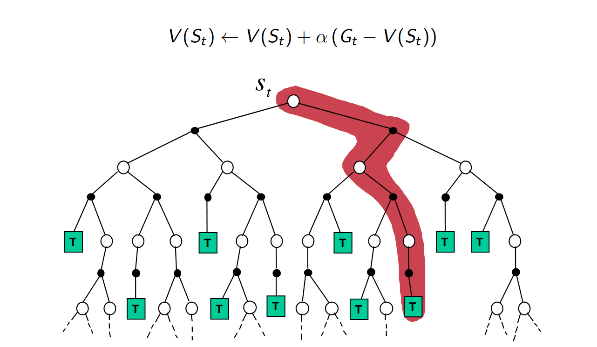
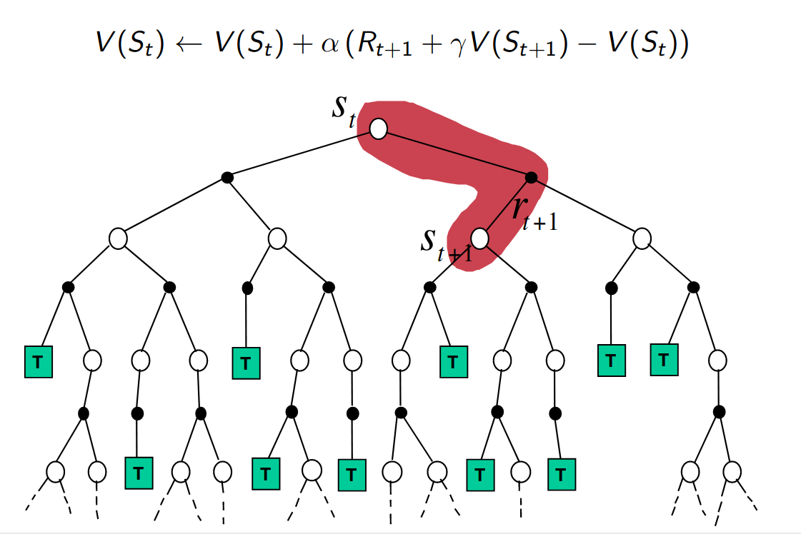
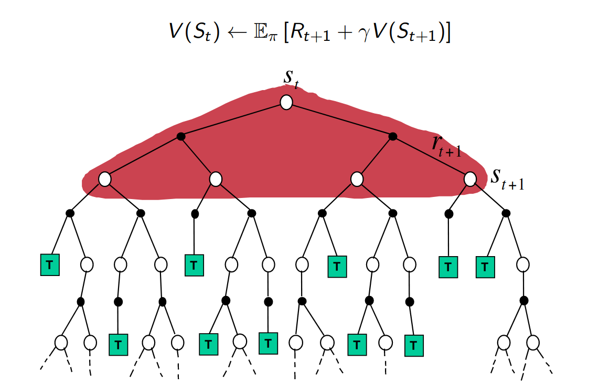
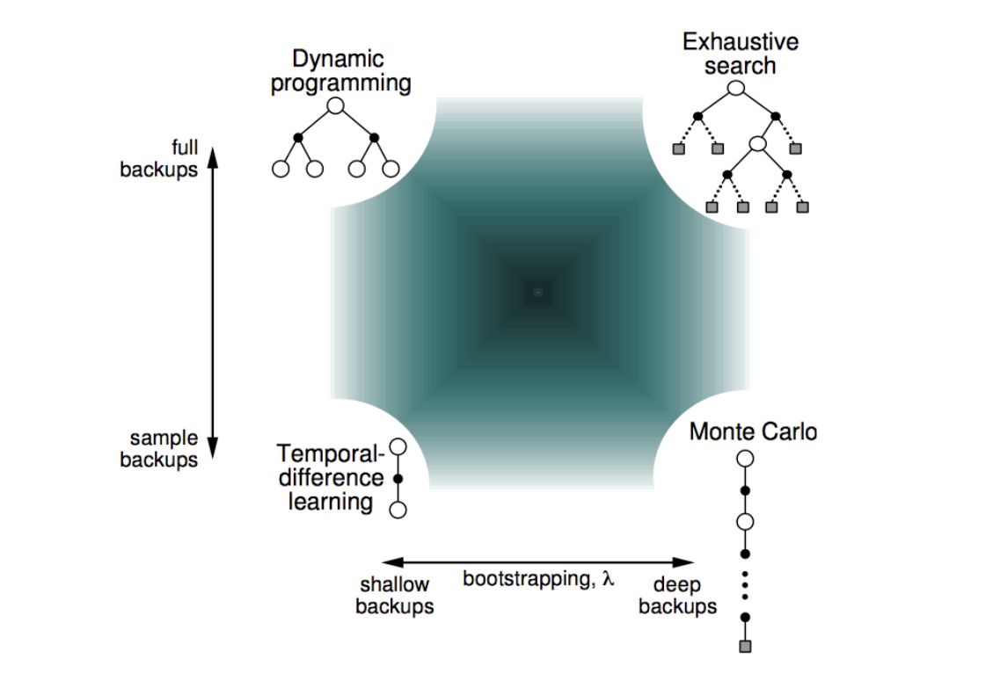
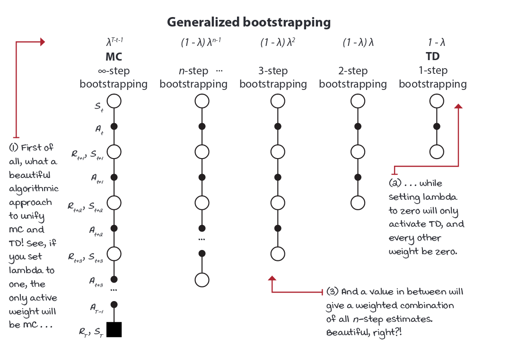

## Gole

Learn $V_\pi$ of a given policy $\pi$ in a model-free environment.

We will see two approaches:
1. Monte Carlo 
2. Temporal difference

---
## Monte Carlo Learning
For each $E_n$ for each $S_t^n$.

1. $\color{#405198}T_{n+1}(S_t^n) =T_{n}(S_t^n) + G_{t:T}^n$ for rest $\color{#a23131}T_{n+1}(s) =T_{n}(s)$
2. $\color{#405198}N_{n+1}(S_t^n) = N_{n}(S_t^n) + 1$ for rest $\color{#a23131}N_{n+1}(s) = N_{n}(s)$
3. $\color{#405198}V_n(S_t) = \frac{T_n(S_t)}{N_n(S_t)}$ for rest $\color{#a23131}V_{n+1}(s)= V_n(s)$ 

When $N(s)\to\infin, V(s) \to v_\pi(s)$ .

---
## Incremental Mean

The mean $\mu_1$,$\mu_2$,... of a serquence $x_1$, $x_2$, $x_3$,.. can be camputed incrementally.

$$ \begin{split} \mu_k &=  \frac{1}{k}\sum_{j=1}^k x_j = \frac{1}{k}\Bigg( x_k + \sum_{j=1}^{k-1} x_j\Bigg) \\ & = \frac{1}{k}(x+k + (k-1)\mu_{k-1}) \\ & = \color{#405198} \mu_{k-1} + \frac{1}{k}(x_k - \mu_{k-1}) \end{split} $$

---
## Incremental Monte-Carlo Updates
For each $E_n$ for each $S_t^n$.
1. $\color{#405198}N_{n+1}(S_t^n) = N_{n}(S_t^n) + 1$ for rest $\color{#a23131}N_{n+1}(s) = N_{n}(s)$
2. $\color{#405198}V_{n+1}(S_t) = V_{n}(S_t)+\frac{G_{t:T}^n -V_n(S_t)}{N_n(S_t)}$ for rest $\color{#a23131}V_{n+1}(s)= V_n(s)$ 

or 

2. $\color{#405198}V_{n+1}(S_t) = V_{n}(S_t)+\textcolor{green}{\alpha}({G_{t:T}^n -V_n(S_t)})$ 
   for rest $\color{#a23131}V_{n+1}(s)= V_n(s)$ 

---

## Temporal-difference Learning
* Update value $V_n(S_t)$ toward actual return $G_t$.

$$V_{n+1}(S_t) = V_{n}(S_t)+{\alpha}(\textcolor{red}{G_{t:T}^n} -V_n(S_t))$$

* Temporal-difference learning algorithm: TD(0)
  * Update value $V_n(S_t)$ toward estimated return $\color{red}R_t^n + \gamma V_n(S_{t+1})$
$$ V_{n+1}(S_t) = V_{n}(S_t)+{\alpha}(\overbrace{\underbrace{\textcolor{red}{R_t^n + \gamma V_n(S_{t+1})}}_{\text{TD target}} -V_n(S_t)}^{\text{TD error}})$$

---
## Advantages and Disadvantages of MC vs. TD
* TD can learn before knowing the final outcome.
  *  TD can learn online after every step.
  *  MC must wait until end of episode before return is known.
* TD can learn without the final outcome
  * TD can learn from incomplete sequences
  * MC can only learn from complete sequences
  * TD works in continuing (non-terminating) environments
  * MC only works for episodic (terminating) environments

---
## MC

---
## TD

---
## DP

---
## Bootstrapping and Sampling

* Bootstrapping: update involves an estimate 
  * MC does not bootstrap 
  * DP bootstraps 
  * TD bootstraps 
* Sampling: update samples an expectation 
  * MC samples 
  * DP does not sample 
    * TD samples
---

---

## N-Step temporeal-difference learning
Given a $E_n$ we define
$$ G_{t:t+n} := R_t + ...+ \gamma^{m-1} R_{t+n} + \gamma^n V_{t+n-1}(S_{t+n}) $$

$$V_{n+1}(S_t) = V_{n}(S_t)+{\alpha}(\underbrace{\overbrace{\textcolor{red}{G_{t:t+n}}}^{n-step ~target} -V_n(S_t)}_{n-step~error})$$

---

---
## TD($\lambda$)

$$ G_{t:T}^\lambda := (1-\lambda) \sum_{n=1}^{T-t} \lambda^{n-1} G_{t:t+n} $$

$$V_{n+1}(S_t) = V_{n}(S_t)+{\alpha}(\underbrace{\overbrace{\textcolor{red}{G_{t:T}^\lambda}}^{\text{$\lambda$-return}} -V_n(S_t)}_{\text{$\lambda$-error}})$$

---
## TD($\lambda$) Backward-view 

1. Set $e_0(s)=0 ~ \forall s \epsilon \mathbb{S}$ every new episode.
2. When we encounter a state $s$.   $e_t(s) = e_{t-1}(s)+1$ 
3.  $\delta_{t:t+1}^{\text{TD}}= R_{t+1} + \gamma V_t(S_{t+1}) -V_t(S_t)$
4.  $V_{t+1} = V_t +\alpha\delta_{t:t+1}^{\text{TD}}e_t$
5.  $e_{t+1} = e_t \gamma \lambda$

---
## Thanks  <!-- fit -->
