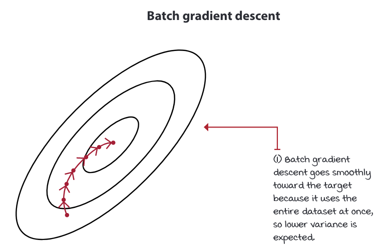
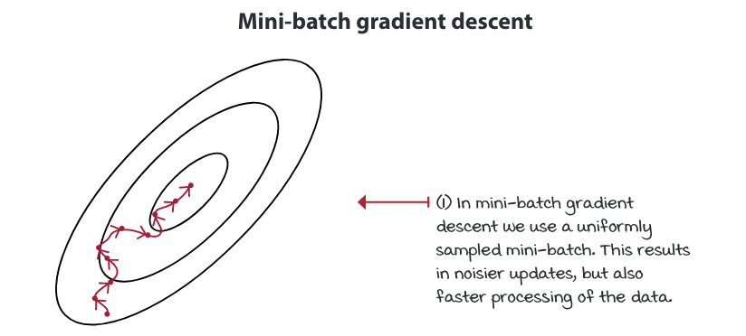
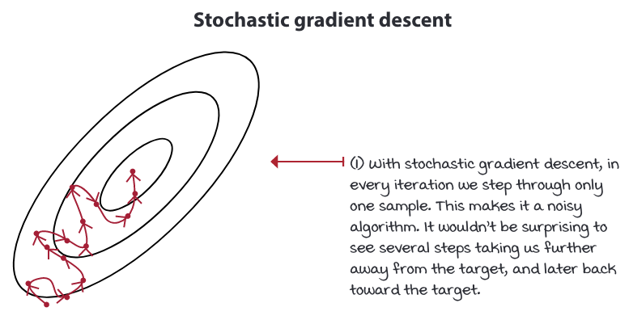

# Sequential feedback

1. Reward can be delayed.
2.  Hard to assign credit for rewards.

# Immediate feedback

1. Supervised learning.
2. Rewards are assigned to the action just taken.
---
# Evaluative feedback
1.  goodness of feedback is relative.
2.  " is it the best !!"

# Supervised feedback
1. Classification problem.
2.  No guessing; if the model makes a mistake, the correct answer is provided immediately.

---
# Sampled feedback
1. Generalisation of gathered feedbacks.
2.  Supervised learning

# Exhaustive feedback
1. Has access to all possible samples.
2.  Tabular reinforcement learning.

---

# Function approximation RL.
* high dimensions of state and action space.
* continuous state and action space.
* Through this, we can use generalization.

$$
Q(\textcolor{blue}{s},\textcolor{red}{a};\textcolor{green}{\theta_i})
$$

---
# Ideal objective.

$$
L_{i}\left(\theta_{i}\right)=\mathbb{E}_{s, a}\left[\left( \textcolor{green}{ q_{*}(s, a) } - \textcolor{red}{ Q\left(s, a ; \theta_{i}\right) } \right)^{2}\right]
$$

 
Where Optimal action-value function is

$$
\textcolor{green}{q_{*}(s, a)}=\max _{\pi} \mathbb{E}_{\pi}\left[G_{t} \mid S_{t}=s, A_{t}=a\right], \forall s \in S, \forall a \in A(s)
$$

---
# On-policy and off-policy TD targets

#### on-policy 
$$
y_{i}^{\text {Sarsa }}=R_{t+1}+\gamma Q\left(S_{t+1}, A_{t+1} ; \theta_{i}\right)
$$

#### off-policy
$$
y_{i}^{Q \text {-learning }}=R_{t+1}+\gamma \max _{a} Q\left(S_{t+1}, a ; \theta_{i}\right)
$$

---
# Q-learning target, an off-policy TD target

$$
y_{i}^{Q \text {-learning }}=R_{t+1}+\gamma \max _{a} Q\left(S_{t+1}, a ; \theta_{i}\right)
$$

$$
L_{i}\left(\theta_{i}\right)=\mathbb{E}_{s, a, r, s^{\prime}}\left[\left(r+\gamma \max _{a^{\prime}} Q\left(s^{\prime}, a^{\prime} ; \theta_{i}\right)-Q\left(s, a ; \theta_{i}\right)\right)^{2}\right]
$$

$$
\nabla_{\theta_{i}} L_{i}\left(\theta_{i}\right)=\mathbb{E}_{s, a, r, s^{\prime}}\left[\left(r+\gamma \max _{a^{\prime}} Q\left(s^{\prime}, a^{\prime} ; \theta_{i}\right)-Q\left(s, a ; \theta_{i}\right)\right) \nabla_{\theta_{i}} Q\left(s, a ; \theta_{i}\right)\right]
$$
---

---

---

